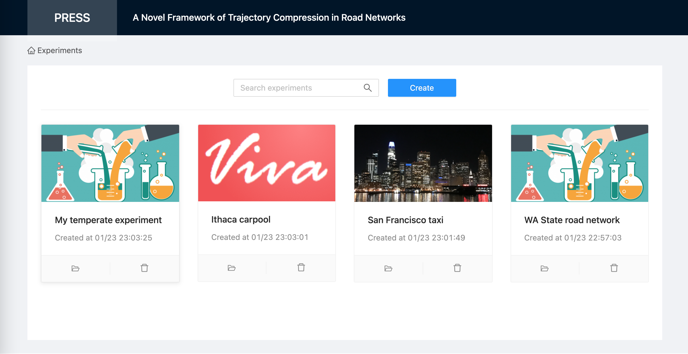

PRESS
=====

[PRESS: A Novel Framework of Trajectory Compression in Road Networks](http://www.vldb.org/pvldb/vol7/p661-song.pdf)

## Authors
* [Renchu Song](http://www.songrenchu.com)
* [Prof. Weiwei Sun](http://homepage.fudan.edu.cn/wwsun/)
* [Prof. Baihua Zheng](http://www.mysmu.edu/faculty/bhzheng/)
* [Dr. Yu Zheng](http://research.microsoft.com/en-us/people/yuzheng/)

## V3
V3 version is the re-written version of the experiments for better code quality and ease of use.
To get the initial experiment code, switch to master branch and take a look at v1 folder.

This is an ongoing effort. Currently only PRESS core service is finished.

### Verified OS

PRESS is verified to run on the following OS:

| OS Type    | Version |
|------------|---------|
| MacOS      | 10.13.3 |
| Ubuntu     | 14.04   |

### Dependencies

| Dependency | Version |
|------------|---------|
| g++        | 4.8.2   |
| Go         | 1.15.6  |

Follow this document to install [latest Go](https://golang.org/doc/install) for your OS.

### Install PRESS

To install PRESS, run:
```
./install.sh
```
It compiles service binaries, materializes config file based on the local path you cloned the code, and downloads sample dataset(s).

### Start/Stop PRESS

To start PRESS, run:
```
./padmin.sh start
```
To stop PRESS, run:
```
./padmin.sh stop
```

### Run sample code

To run sample code of calling the APIs of PRESS Core service, run:
```
./run_press_test_client.sh
```
Please make sure your computer has at least 8G memory to run the sample dataset(s).

Read core/src/press_core_test_client.cpp to learn sample code of calling the APIs of PRESS service in C++.

Read core/src/ad_hoc.cpp to learn sample code of directly calling the C++ functions in PRESS without going through the service APIs. This might be good for quick ad-hoc experiments.

### Bring your own data

Step 1. Create a new folder under data;

Step 2. Put your road network data in the folder and name as road_network.txt;

Step 3. Put your GPS trajectories in the folder;

Step 4. Read the code in core/src/user_defined/. Take a look at factory.hpp, factory.cpp and search for [USER DEFINE] tags. Then take a look at each subfolder. You can follow the examples to write your own logic to load your own data (road network, gps trajectory, etc) with any format to the data structures PRESS uses;

Step 5. Follow core/src/press_core_test_client.cpp to test your loading logic with ReadRoadnetFromDataSource and AddGPSTrajectoryAndMapMatch APIs.

Step 6. Re-compile the PRESS core service and test your code. PRESS core will log to core/logs/ folder. You can also comment out
```
  // Daemonize.
  daemonize();
```
in core/src/press_core.cpp main function and use cout to print debug information, if that makes things easier.

### TODO

Write a UI portal to facilitate doing experiments.

Preview:

